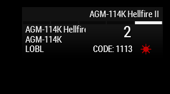

# Guided Munitions

## RHS Guided Weapons


RHS guided munitions default to camera position if a laser is not on or detected or selected using **T**.


### AGM-114K Hellfires

These work by using the camera position and not the laser designator present on the helicopter to track a target. No matter where the camera is pointing, the hellfire will track to that position.

The hellfire will always prioritise the helicopter's laser designator over anyone elses. Highly manoeuvrable with a tracking cone of 160 degrees. It will always follow where the camera is looking.

If the helicopter does not have it's laser on and there are additional lasers present in the area, it will hunt for the nearest one and track that. It cannot differentiate between different laser codes.

### AGM-114L Hellfires


These missiles are buggy and can result in mis-fires or missiles not tracking the correct target.


Radar guided, fire and forget versions of the 114Ks. Do not reguire a laser for a target lock and will automatically search for a target and destroy it. To lock onto a target, turn on the radar and press `R` , it will take 3-5 seconds to lock on, with a continuous beeping noise indicating targeting solution ready. Fire and go cold.

These missiles have a bug where they will follow the laser instead of their own radar or a target marked using the helicopter's radar. If another laser is on, and the gunner presses `R` the hellfire will only lock onto the second laser.

### DAGR&#x20;

Laser guided hydras, very fast rockets not very manoeuvrable due to their speed. Due to their speed, the gunner will have to use a slight offset to account for the DAGR not being able to turn as fast as needed. The closer the target is to the helicopter, more offset is required to hit or disable the target.

DAGRs are to be used with the helicopter's camera and no other source. If locking on to an external laser source, they will head towards it and just before impacting will follow where the camera is looking. Looks hilarious when it flies just above a tank to follow the camera crosshair.

### ACE Guided Weapons


ACE missiles are common across all RHS, CUP and Vanilla helicopters. Hatchet uses ACE in the background, but adds extra functionality. Read docs for Hatchet on their implementation.


### AGM-114K Laser Guided Hellfires

These require a proper laser code and need the seeker head of the hellfire to be able to detect the laser endpoint. The modes LOAL modes, DIR, HI, and LO have to reach their respective alltitudes above the helicopter before the seeker head activates. The heights are explained [here](./#viper-+-apache).

Laser codes on helicopters are shared between the seeker head and the helicopter's laser designator, so make sure the helicopter's laser designator is not on, otherwise the missile will track the helicopter's laser designator.

<figure><figcaption>
<em><mark style="background-color:green;"><strong>Figure 1 : 114K in LOBL with laser detected</strong></mark></em>
</figcaption></figure>

For Lock-On-Before-Launch (LOBL), the seeker head has a detection arc of 20 degrees arc off the nose of the missile. A red star symbol will appear on the top right as show in Figure 1. This means that the seeker head as detected the laser end-point and will track the end-point.

In LOAL modes, the seeker head has a detection arc of 7.5 degrees arc off the nose of the missile. It's smaller but allows the helicopter to fire off the missle while being in cover. To make sure the missile tracks set a waypoint for the target location and orient the helicopter in that direction, 98-99% chance the hellfire will track. The remaining 1-2% depends upon the distance of the target from the  helicopter.

There is no proper symbology which appears for the 114K, as long as the laser is painting the target and the hellfire can detect the laser, it will track it and destroy the target.

### AGM-114L Radar Guided Hellfires


114L will also track a laser, if seeker head is calibrated to the code and is present. This is a bug and can be walked around by switching off the laser or changing the seeker head laser code


Radar guided, fire and forget version of the 114K(ACE). These rockets have an in-built radar and will actively hunt for targets after being launched. There are two main modes, LOBL where the target is selected either using the FLIR or the Fire-Control Radar and LOAL in which the missile will actively hunt for radar contacts after reaching the in-built height. DIR, HI and LO have the same parameters as in the 114K. The parameters are explained [here](./#viper-+-apache).

#### Using Fire Control Radar(FCR) : Apache

This is the base game radar and will continously scan ahead of the helicopter in a 88 degree arc. The target can be selected by pressing `R` and cycling through all available targets by pressing the same key. It takes less than one second for locking on and can fire as long as the diamond on the target is closed as shown in Figure 2.

<figure><figcaption>
<em><mark style="background-color:green;"><strong>Figure 2  : Proper Firing solution</strong></mark></em>
</figcaption></figure>

#### Using FLIR

A target can be locked for 114L by looking at a target and pressing `T` , if a closed diamond like in Figure 2 appears, then the hellfire will track otherwise orient the helicopter for a better firing solution. Figure 3 shows the symbology when a hellfire will not be able to track the target.

<figure><figcaption>
<em><mark style="background-color:green;"><strong>Figure 3 : Improper Firing Solution</strong></mark></em>
</figcaption></figure>

#### Lock On After Launch (LOAL)

The hellfire will go active after reaching the altitude as determined by the LOAL mode and hunt for a target using it's own radar. This is best used in a target rich environment hiding behind a structure or natural obstructions. Fire and re-position, no need to stick around.

### Wire Guided Missiles : HOT

There are 4 types of wire guided missiles,

1. HOT 1 : Able to penetrate around 800mm RHA. Max range is 4000 meters. HEAT
2. HOT 2 : Able to penetrate around 900mm RHA. Max range is 4000 meters. HEAT
3. HOT 2MP : Anti-Infantry. Contains 1000 steel balls that scatter on impact. Also contains a chemical incendiary device which has a kill radius of around 20 meters. Able to penetrate around 350mm RHA. Max range is 4000 meters. HE
4. HOT 3 : Able to penetrate around 1250mm RHA. Max range is 4300 meters. Tandem HEAT

> The above 4 points are sourced from the [ACE wiki](https://ace3.acemod.org/wiki/).

After the maximum range is achieved the wire will snap and the hellfire will travel in the heading before the snap.

All of the wire guided missiles need training as there is a considerable offset required to get the missiles on target especially if the target is more than 2 degrees off the nose. Just pointing at the target will not work.

The trajectory of the missile is determined by the heading in which the camera is pointing and the missile will automatically calculate the amount it needs to turn. Due to the high speed, the turn may not be as tight as needed. To counter this, the gunner has to give continous changes in the direction of the target and guide the missile onto it.&#x20;

Aim slightly lower as the missile sits 0.5m above the crosshair of the camera at all times.&#x20;
