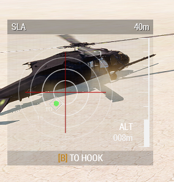
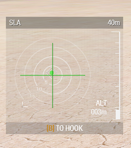
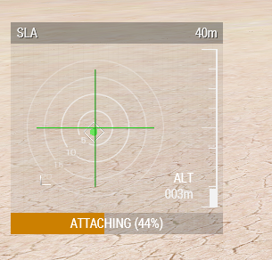
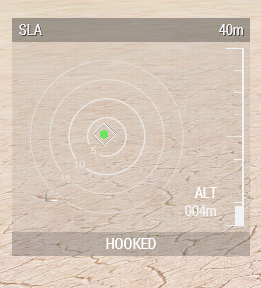

# Base Game Sling Load

The base game sling loading was introduced with the Helicopters DLC to allow objects to be slung under a helicopter.&#x20;

It works by definining the maximum mass a helicotper can pick in the config and whether nearby objects have a lower mass than defined and have sling load memory points defined in the config.

This method is quite restrictive as it more often than not, most objects do not have sling load memory points defined in the configuration file rather than being over the maximum slung mass.

### Usage

To find objects which can be slung, opent the sling load assistant panel either via a set keybind or cycling the left panel with _<mark style="color:blue;">**\[**</mark>_ or right panel with _<mark style="color:blue;">**]**</mark><mark style="color:blue;">.</mark>_ The sling load assistant panel will show the location of all sling loadable objects with respect to the helicopter in a 2D top-down view.

<figure><figcaption>
Hovering to pick up cargo
</figcaption></figure>

<figure><figcaption>
Cargo is within limits and right below the helicopter
</figcaption></figure>

The vertical and horizontal line show how far the object is far from the centre of the helicopter. By default they are red and turn green when the object is within distance to hook up. Both the lines can individually turn green when the previous mentioned condition is satisfied.

<figure><figcaption>
Ropes deploying
</figcaption></figure>

 

<figure><figcaption>
Cargo is hooked
</figcaption></figure>

There is a progress bar at the bottom of the sling load assisstant panel which gives the status of the rope length and whether it is hooked to the object or not. The moment the object is hooked, apply power and gain height.

### Keybinds

The following keybinds are found under _Helicopter Movement_.

1. Sling Load Assistant : Found under Helicopter movement, default it set to <mark style="color:blue;">Right Ctrl + B</mark>. Conflicts with _Dismount Where You Look_, so unbind any keybinds from that mod.
2. Rope interaction : simply <mark style="color:blue;">B</mark>.
