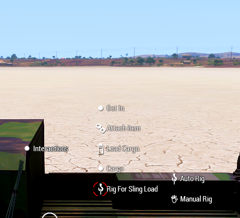

# Sling Load Rigging Mod

Sling Load Rigging mod changes how the ropes are used for carrying cargo using helicopters. It does not change the maximum sling load as defined in the configuration file in the helicopter.

<figure><figcaption>
Cargo Sling in Inventory
</figcaption></figure>

To attach the hooks and use the ropes, a player needs `Cargo Sling`  in their inventory. Only one is needed and they are available in the inventory of all helicopters.

ACE interactions are specified in <mark style="color:green;">green</mark>.

## Usage

The mod uses ace for all interaction including attaching the cargo to the helicopter. There are two types of hooks,

1. Cargo hook : Attaches to the cargo which needs to be slung
2. Sling hook : Attaches to the helicopter at pre-defined points. Also called Apex Fitting.

Helicopters will have `Attach Cargo`  points on the chassis of the helicopter. Dependent upon the size of the helicopter, there will be different number of `Attach Cargo` points.

### &#x20;Hook

<figure><figcaption>
Auto Rig and Manual rig options
</figcaption></figure>

Approach the cargo and check for interaction to either <mark style="color:green;">auto-rig</mark> or <mark style="color:green;">manual-rigging</mark>. Manual-rigging is preferred as the player can attach cargo hooks in multiple places for better stability of the cargo. Auto-rigging will automatically set-up the hooks and ropes.

<figure><figcaption>
Attaching hook via manual rigging
</figcaption></figure>

<figure><figcaption>
3 groups of hooks via manual rigging
</figcaption></figure>

A player can attach cargo hooks all at-once or in groups for example, a humvee can have three groups, forward hooks (FORWARD), side hooks(SIDE) and rear hooks(REAR). Groups can be made by attaching as many cargo hooks as you want, selecting done on the interaction menu, and once again selecting manual rigging from the cargo's interaction menu.

Each group will be linked to a sling hook, attaches to the helicopter. Each groups' sling hook can attach at different `Attach Cargo` points. They can also go the same one.

The sling hook can be dropped and picked up again as required. Does not always have to be in hand.

### Cargo

More than one item of cargo be slung under a helicopter using this mod. For example a chinook can carry two humvees by using all hooks or jsut using aft and rear hooks. Keep in mind that collision damage is still enabled so they will damage each other if flown rough, so slow is smooth, smooth is fast.

### Ropes

<figure><figcaption>
Interactions for changing the length of ropes.
</figcaption></figure>

Ropes are linked between the Sling Hook and it's corresponding Cargo hooks. The default length of the rope is 10m. The length of the ropes are shown in a hint on the top-right corner, showing either only one rope or all ropes.

The lenght of the ropes can be changed via ace interaction menu. There are two options,

<figure><figcaption>
Changing rope length for selected hook(yellow circle) 
</figcaption></figure>

1. <mark style="color:green;">Single rope</mark> length : The rope is selected by walking to the corresponding hook and scroll wheel while looking at it. The hook is confirmed when a yellow circle appears on it.

<figure><figcaption>
Changing for all hooks.
</figcaption></figure>

2. <mark style="color:green;">All ropes</mark> length : All the ropes attached to the cargo will be either lengthened or shortened via the scroll wheel.

Remove rigging removes the ropes and cargo hooks from the cargo. If the cargo is dropped from a helicopter, then only the hooks are removed.&#x20;

### Attach Cargo Points

Each helicopter has a specified set of points defined via the mod. For heavier helicopters, there are three points, forward, centre and rear `Attach Cargo` points, while medium and light helicopters have one in the centre.

To attach a Sling hook, approach any `Attach Cargo` point with the sling hook in hand and look for the ACE interaction, _<mark style="color:green;">Attach Cargo</mark>_,  to attach the sling hook to the point. Multiple sling hooks can be attached to the same point.

For a few helicopters, such as the Sea Stallion, the player may have to crawl under the helicopter to find the `Attach Cargo` points.
